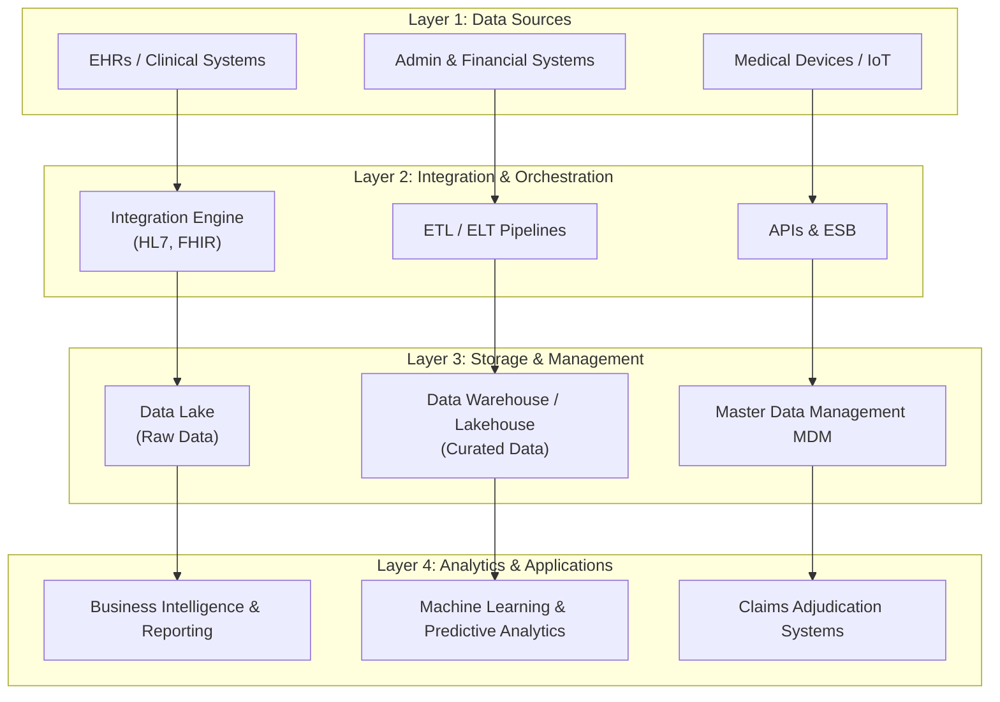
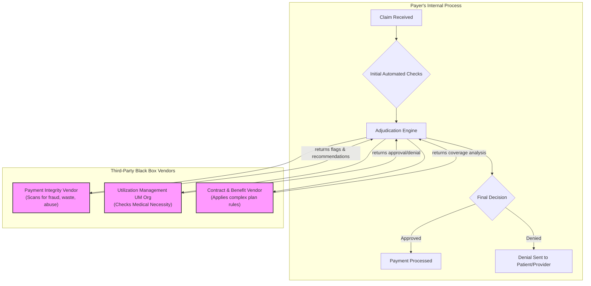

Blackbox Consensus: The Potential for Misalignment in Health Data Integration for Patient Outcomes in Claim Adjudication
The pursuit of total data integration has been a foundational goal in health informatics for decades. This ambition long predates even landmark regulations like the Health Insurance Portability and Accountability Act of 1996, whose full title begins, "An Act To amend the Internal Revenue Code of 1986 to improve portability and continuity of health insurance coverage..." (Pub. L. No. 104-191). This legislative focus underscored a fundamental challenge: without the ability to easily move health information between providers and locations, patients faced substantially more complex and fragmented healthcare decisions. Early efforts were often constrained by the high cost of on-premise computing and the technical limitations of disparate systems. However, the widespread adoption of cloud computing and big data platforms has fundamentally altered this landscape. Fueled by this new technological power and driven by the promise of enhanced efficiency and personalized medicine, healthcare organizations are now investing heavily in sophisticated technical architectures to eliminate data silos. The objective is laudable: to create a unified, longitudinal patient record accessible across the care continuum.

However, this technological pursuit presents a parallax—an apparent shift in an object's position due to a change in the line of sight. Viewed from the perspective of enterprise operations, data integration is a panacea for fragmentation and inefficiency. Viewed from the patient's perspective, however, the same infrastructure can manifest as an opaque system of control that may subordinate individual clinical needs to institutional objectives. This analysis will critically examine the architecture of these integrated systems, detailing the specific data flows and technologies involved, and argue that without deliberate governance, their primary effect may be the consolidation of institutional power rather than the empowerment of the patient.
Architecting the Centralized Health Data Ecosystem: A Deeper Analysis
The technical feat of modern data integration involves constructing a multi-layered infrastructure designed to ingest, manage, and analyze data at a massive scale. This ecosystem moves beyond simple point-to-point interfaces to create a central repository of curated health information. A detailed examination of this process reveals a complex data lifecycle.
Data Ingestion and Federation: The Digital Front Door
The initial challenge is unifying heterogeneous data sources, each with its own standards, formats, and latencies. Integration engines like Mirth Connect or Infor Cloverleaf are critical at this stage. For instance, a typical Health Level Seven (HL7) v2 message, containing an admission or a lab result, is received via a TCP port. The engine parses this pipe-and-hat delimited text into a structured format (often XML or JSON). It then applies transformation logic—mapping proprietary Z-segments, validating data fields, and enriching the message with data from other sources via API calls—before routing it to downstream systems. Concurrently, modern, API-driven data streams using Fast Healthcare Interoperability Resources (FHIR) are handled through secure RESTful endpoints, providing a more standardized, resource-oriented flow of information. This layer must also accommodate batch data from claims systems (in X12 EDI format) and streaming data from Internet of Things (IoT) medical devices.
Harmonization and Curation: From Raw Data to Actionable Insight
Once ingested, data is channeled into a cloud-based data lakehouse, a hybrid architecture combining the flexibility of a data lake with the management features of a data warehouse. Platforms like Databricks (built on Apache Spark) and Snowflake are dominant in this space. The data flow typically follows a medallion architecture:
Bronze Layer: Raw, untransformed data is landed here from the integration engine. It is the immutable source of truth.
Silver Layer: Data from the bronze layer is cleaned, deduplicated, and conformed. For example, patient records from multiple source systems are linked using a Master Patient Index (MPI), and clinical terminologies are mapped to standards like SNOMED CT or LOINC. This is where tools like Python with libraries such as Polars (for performance) or PySpark are used for large-scale data transformation.
Gold Layer: Data from the silver layer is aggregated and organized into business-centric data models. These are the analysis-ready tables that power reporting and machine learning, such as a patient-level table with features for predicting readmission risk. Apache Iceberg is often used as the open table format to provide ACID transactions, schema evolution, and time-travel capabilities directly on the data lake.
Analytics and Application: Activating the Data
The curated data in the gold layer supports a range of functions. Business intelligence tools like Tableau or Power BI connect to these tables for operational dashboards. More critically, data science teams use platforms like Databricks Machine Learning or AWS SageMaker to develop and deploy complex predictive models. These models, trained on vast historical datasets, are designed to stratify patient risk, predict disease progression, identify potential fraud, and optimize resource allocation. The outputs of these models are then fed back into clinical or operational systems, often via API, to influence decision-making.
This architectural model represents a significant leap in technical capability, successfully solving many long-standing problems of interoperability and data fragmentation.
Figure 1: Conceptual Model of an Enterprise Health Data Architecture

The Unintended Consequences: Algorithmic Opacity and the Diffusion of Accountability
While technologically impressive, a primary application of this integrated data—particularly for payers—is the optimization of claims adjudication and utilization management. This operational focus introduces significant consequences for the patient by creating systems characterized by algorithmic opacity and a diffusion of accountability.
The process is no longer a simple transaction between a provider and a payer. Instead, it is a multi-stage, automated workflow that often delegates key decisions to third-party vendors. These external entities provide specialized services in payment integrity, utilization review, and benefits administration, each employing proprietary algorithms. This complex arrangement, modeled below, fundamentally alters the dynamic of care authorization and payment.
Figure 2: The Role of Third-Party Vendors in Claims Adjudication

This model creates two critical issues:
Algorithmic Opacity: The decision-making logic of third-party vendors is almost always a protected "black box." A claim may be denied based on an algorithmic determination, yet neither the patient nor the provider has access to the specific rules or weighting that led to that conclusion. This creates a profound information asymmetry and risks perpetuating systemic biases. A landmark study by Obermeyer et al. (2019) found that a widely used commercial algorithm was significantly biased against some patients because it incorrectly used healthcare costs as a proxy for health needs, thereby systematically disadvantaging a population that incurs lower health costs for a given level of illness.
Diffusion of Accountability: When a claim is denied, the locus of responsibility becomes obscured. The payer can attribute the decision to its vendor, while the vendor is accountable only to the payer. This structure creates a digital version of the "bystander effect," a sociopsychological phenomenon first detailed by Darley and Latané (1968) as a "diffusion of responsibility." Just as the presence of multiple onlookers can reduce any single individual's impulse to intervene in an emergency, the multi-party, automated nature of claims adjudication makes it difficult to assign clear accountability for an adverse decision (Cummings & Rawson, 2023). This arrangement makes the appeals process exceptionally difficult.
The Provider's Dilemma: Caught Between Patient Needs and System Demands
This system places healthcare providers in an untenable position. While data integration promises a holistic patient view to improve clinical decisions, it simultaneously fuels an administrative apparatus that erodes their professional autonomy and consumes valuable resources. Clinicians and their staff are forced to spend an inordinate amount of time contesting automated denials, engaging in time-consuming "peer-to-peer" reviews, and generating extensive documentation not for clinical purposes, but to satisfy the demands of an algorithm. This immense administrative burden is a well-documented driver of physician burnout. Furthermore, it represents a fundamental erosion of clinical judgment, as the provider's expert opinion is often subordinated to a rigid, automated rule set that cannot account for the nuances of an individual patient's condition.
A Case Study in System Failure: The Patient's Journey
To illustrate the practical implications of this model, consider the following hypothetical patient journey. A 45-year-old patient with a complex autoimmune condition is recommended a newer biologic drug by her specialist based on her specific genotype and poor response to older therapies. The claim is automatically denied by the insurer's system, with the Explanation of Benefits citing a generic reason: "step-therapy required." The specialist's office spends weeks submitting appeals and providing documentation. During this delay, the patient's condition worsens, leading to a preventable hospitalization. The system, designed for cost-containment, has not only failed to account for the specific clinical needs of the patient but has also generated a higher long-term cost, all while causing significant patient harm and disempowerment. This case is not an outlier; it is a predictable outcome of a system where operational metrics are decoupled from patient well-being.
The Narrative of Patient-Centricity and the Incentives of Liability
Compounding these issues is the pervasive corporate narrative of "patient-centricity." Health insurers and technology vendors frequently frame their solutions as being designed to empower patients, yet this rhetoric often masks underlying priorities. As Weissman et al. (2017) note, "patient-centered care" remains one of the most-used and least-understood terms, with a significant gap between the marketing ideal and operational reality.
This gap is widened by the regulatory and legal landscape. The legal frameworks governing AI in healthcare are still evolving, creating ambiguity around liability for algorithmic harm. In this environment, a powerful incentive exists for organizations to limit their legal exposure. Full transparency into how an algorithm works could reveal flaws or biases that create grounds for malpractice or product liability lawsuits. Therefore, a rational, risk-averse corporate strategy is to keep algorithmic processes opaque, treating them as proprietary trade secrets. This directly conflicts with the principles of transparency and shared decision-making that are foundational to genuine patient-centricity. Regulations, intended to protect, can thus have the perverse effect of incentivizing companies to withhold information and avoid acknowledging harms in favor of limiting liability.
Conclusion: Toward a Framework for Accountable Data Governance
The advancement of enterprise data integration in healthcare is inevitable and offers substantial potential benefits. However, to ensure these benefits accrue to patients as well as institutions, the focus must expand from technical implementation to robust governance. Achieving a more equitable balance requires a framework centered on accountability and transparency. This includes:
Algorithmic Auditing: Establishing standards for the independent auditing of proprietary algorithms to ensure they are clinically valid and free from the types of bias identified by researchers (Obermeyer et al., 2019). This addresses the ethical question of responsibility for algorithmic harm (Aquino et al., 2024).
Enhanced Transparency and Explainability: Mandating that explanations of benefits (EOBs) for denied claims provide clearer insight into the decision-making rationale. The growing industry discourse around "explainable AI" acknowledges the need to move away from "black box" systems toward auditable processes.
Strengthened Data Stewardship: Developing governance models that treat patient data not merely as an asset to be optimized but as a clinical entity that requires fiduciary-level stewardship, with clear lines of responsibility that counteract the natural tendency toward diffusion.
To break the cycle of misaligned incentives and ensure these governance principles are upheld, an external, unbiased mechanism for oversight is required. The current system lacks a trusted arbiter to report on real-world outcomes. Therefore, a crucial step forward is the empowerment of independent bodies—such as academic institutions, non-partisan NGOs like The Commonwealth Fund or the Kaiser Family Foundation, or designated government organizations—to serve this function. These organizations could be tasked with independently auditing algorithmic outcomes, analyzing their impact on different patient populations, and publishing their findings. Such transparent, third-party reporting would create an essential feedback loop, providing policymakers with the unbiased evidence needed to craft more effective, patient-focused regulations and holding the industry accountable to its promise of better care.
